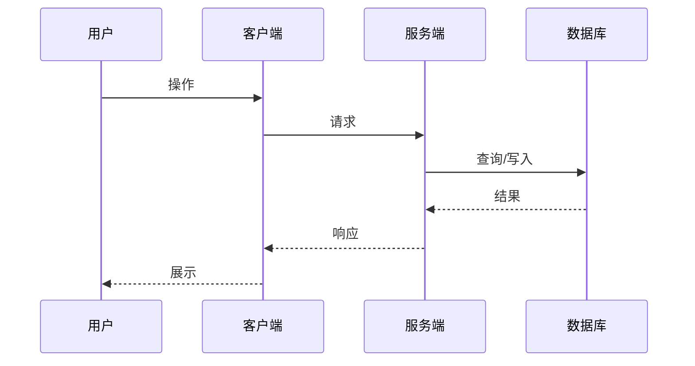
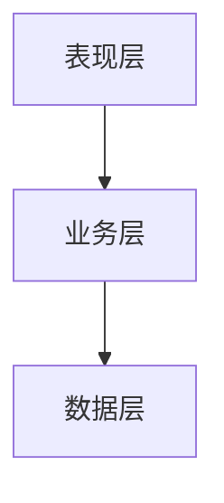

# Teamwork 文档模板

> 所有模板文件位于功能目录 `docs/features/F{编号}-{功能名}/` 下

---

## 目录结构

```
docs/
├── features/                          # 功能目录（每个功能独立）
│   ├── F001-用户登录/                  # 功能编号-功能名
│   │   ├── PRD.md                     # 需求文档
│   │   ├── PRD-REVIEW.md              # PRD 评审记录
│   │   ├── UI.md                      # 设计文档（如需要）
│   │   ├── preview/                   # HTML 预览稿目录
│   │   │   ├── login-page.html
│   │   │   └── login-error.html
│   │   ├── TC.md                      # 测试用例
│   │   ├── TC-REVIEW.md               # 测试用例评审记录
│   │   ├── TECH.md                    # 技术方案
│   │   ├── bugfix/                    # Bug 修复记录
│   │   │   └── BUG-F001-001-xxx.md
│   │   └── optimization/              # 优化记录
│   │       └── OPT-001-xxx.md
│   │
│   └── F002-用户注册/
│       └── ...
│
├── architecture/                      # 架构文档目录
│   ├── server/
│   │   └── ARCHITECTURE.md
│   ├── web/
│   │   └── ARCHITECTURE.md
│   └── mobile/
│       └── ARCHITECTURE.md
│
├── decisions/                         # 全局决策记录
│   ├── DEC-001-技术选型.md
│   └── DEC-002-认证方案.md
│
└── KNOWLEDGE.md                         # 项目本地知识库（跨功能积累）
```

**功能编号规则**:
- 格式: `F001`, `F002`, `F003`...
- 自动递增，检查现有最大编号 +1
- 功能名使用中文或英文均可

---

## PRD.md

```markdown
# {功能名称}

## 状态
草稿 | 待评审 | 已确认

## 背景

## 用户故事
作为 [角色]，我希望 [功能]，以便 [价值]

## 功能需求

### P0 (必须)
-

### P1 (应该)
-

### P2 (可选)
-

## 验收标准
- [ ]

## 埋点需求（前端/客户端功能必填）
> ⚠️ 纯后端功能可标注「不适用」

| 埋点名称 | 事件类型 | 触发时机 | 参数 | 用途 |
|----------|----------|----------|------|------|
| | PV/Click/Submit/Error | | | |

## 待决策项
| ID | 问题 | 选项 | 决策 |
|----|------|------|------|

## 变更记录
| 日期 | 变更 |
|------|------|
```

---

## UI.md

```markdown
# {功能名称} - UI 设计

## 状态
草稿 | 待评审 | 已确认

## 预览稿
- [页面1](./preview/page1.html)
- [页面2](./preview/page2.html)

## 用户流程

## 页面结构

### [页面名]

**布局**

**组件**
| 组件 | 类型 | 交互 |
|------|------|------|

**设计标注**
- 主色:
- 字号:
- 间距:

## 响应式
| 断点 | 适配 |
|------|------|

## 状态设计
- 加载态
- 空态
- 错误态

## 变更记录
| 日期 | 变更 |
|------|------|
```

### HTML 预览稿模板

```html
<!-- docs/features/F{编号}-{功能名}/preview/页面名.html -->
<!DOCTYPE html>
<html>
<head>
  <meta charset="UTF-8">
  <meta name="viewport" content="width=device-width, initial-scale=1.0">
  <title>UI-XXX 预览</title>
  <script src="https://cdn.tailwindcss.com"></script>
</head>
<body>
  <!-- 完整的页面预览，包含所有状态 -->
</body>
</html>
```

---

## PRD-REVIEW.md（PRD 评审记录）
```markdown
# {功能名称} - PRD 评审记录

## 当前状态
🔄 第 X 轮评审中 | ✅ 已通过

---

## RD 评审（技术角度）
| ID | 问题 | 类型 | 建议 | 用户确认 | 状态 |
|----|------|------|------|----------|------|
| R1 | | 可行性/复杂度/风险/遗漏 | | 修改/忽略 | 待处理/已处理 |

**工作量预估**: X 人天
**技术风险**: 低/中/高
**RD 结论**: ✅ 可行 / ⚠️ 有风险 / ❌ 不可行

---

## Designer 评审（设计角度）
| ID | 问题 | 类型 | 建议 | 用户确认 | 状态 |
|----|------|------|------|----------|------|
| D1 | | 交互/信息架构/状态/响应式 | | 修改/忽略 | 待处理/已处理 |

**设计工作量**: X 人天
**Designer 结论**: ✅ 可行 / ⚠️ 需补充

---

## QA 评审（测试角度）
| ID | 问题 | 类型 | 建议 | 用户确认 | 状态 |
|----|------|------|------|----------|------|
| Q1 | | 验收标准/边界/异常/可测性 | | 修改/忽略 | 待处理/已处理 |

**QA 结论**: ✅ 清晰 / ⚠️ 需补充

---

## PMO 评审（项目角度）
| ID | 问题 | 类型 | 建议 | 用户确认 | 状态 |
|----|------|------|------|----------|------|
| P1 | | 范围/依赖/时间/优先级/冲突 | | 修改/忽略 | 待处理/已处理 |

**项目风险**: 低/中/高
**PMO 结论**: ✅ 可控 / ⚠️ 有风险

---

## 待用户确认汇总
| 序号 | 来源 | 问题 | 建议方案 | 用户决定 |
|------|------|------|----------|----------|
| 1 | | | | |

---

## 用户确认方式
- 回复「修改 R1」→ PM 按建议修改 PRD
- 回复「忽略 D1」→ 标记为已忽略，记录原因
- 回复「全部接受」→ PM 按所有建议修改
- 回复「通过」→ PRD 进入「已确认」状态

---

## 评审历史

### 第 1 轮 - [日期]
- RD 问题: X 个
- Designer 问题: X 个
- QA 问题: X 个
- PMO 问题: X 个
- 用户确认: 修改 X / 忽略 X
- 结论: 继续修改 / 通过
```

---

## TC.md（BDD/Gherkin 格式）

```markdown
# {功能名称} - 测试用例

## 状态
草稿 | 待评审 | 已确认

---

## Feature: {功能名称}

作为 {角色}
我希望 {功能}
以便 {价值}

---

## 需求覆盖矩阵

| 需求项 | 优先级 | 用例 ID | 状态 |
|--------|--------|---------|------|
| 需求1 | P0 | TC-001, TC-002 | ✅ |
| 需求2 | P1 | TC-003 | ✅ |

覆盖率: X/Y (XX%)

---

## 测试场景

### Scenario: TC-001 {场景描述}
**优先级**: P0 | P1 | P2
**类型**: 功能 | 边界 | 异常

\`\`\`gherkin
Given {前置条件1}
  And {前置条件2，可选}
When {用户操作1}
  And {用户操作2，可选}
Then {预期结果1}
  And {预期结果2，可选}
\`\`\`

**数据库验证**（后端接口需填写）:
| 表名 | 验证项 | 预期值 |
|------|--------|--------|
| users | last_login_at | 更新为当前时间 |

---

### Scenario: TC-002 {场景描述}
**优先级**: P0
**类型**: 功能

\`\`\`gherkin
Given 用户 "test@example.com" 已注册且密码为 "123456"
  And 用户处于登录页面
When 用户输入邮箱 "test@example.com"
  And 用户输入密码 "123456"
  And 用户点击登录按钮
Then 用户应该跳转到首页
  And 用户应该看到欢迎信息 "你好，张三"
\`\`\`

**数据库验证**:
| 表名 | 验证项 | 预期值 |
|------|--------|--------|
| user_sessions | 新记录创建 | session_id 存在 |
| users | last_login_at | 更新 |

---

### Scenario: TC-003 {异常场景}
**优先级**: P0
**类型**: 异常

\`\`\`gherkin
Given 用户 "test@example.com" 已注册
When 用户输入错误密码 "wrong_password"
  And 用户点击登录按钮
Then 用户应该看到错误提示 "密码错误"
  And 用户应该仍在登录页面
  And 登录失败次数应该增加 1
\`\`\`

**API 验证**:
| 接口 | 预期状态码 | 预期 code |
|------|-----------|-----------|
| POST /api/v1/login | 401 | AUTH_FAILED |

---

### Scenario Outline: TC-004 {参数化场景}
**优先级**: P1
**类型**: 边界

\`\`\`gherkin
Given 用户处于注册页面
When 用户输入密码 "<password>"
  And 用户点击注册按钮
Then 用户应该看到 "<result>"

Examples:
| password | result |
| 12345 | 密码至少6位 |
| 123456 | 注册成功 |
| 123456789012345678901 | 密码最多20位 |
\`\`\`

---

## UI 还原检查（如有 UI）

| 检查点 | 设计稿标准 | 状态 |
|--------|------------|------|
| 按钮颜色 | #1890ff | ⬜ |
| 字体大小 | 14px | ⬜ |
| 间距 | 16px | ⬜ |

---

## 实现完整性报告（代码审查时填写）

| 需求项 | 状态 | 代码位置 | 测试位置 |
|--------|------|----------|----------|
| 正常登录 | ✅ | src/auth/login.ts | tests/auth/login.test.ts |
| 密码错误 | ✅ | src/auth/login.ts | tests/auth/login.test.ts |

完整性: X/Y (XX%)

---

## TDD 检查（代码审查时填写）

- [ ] 测试先于实现（检查 git 提交顺序）
- [ ] 后端覆盖率 > 80%
- [ ] 前端覆盖率 > 70%
- [ ] 测试可独立运行
- [ ] 测试命名符合 Scenario 描述
- [ ] 边界条件已覆盖
- [ ] 异常场景已覆盖

---

## 变更记录

| 日期 | 变更 |
|------|------|
```

### Gherkin 语法速查

```
关键字说明：
├── Feature     - 功能描述（一个 TC 文件一个 Feature）
├── Scenario    - 具体测试场景
├── Given       - 前置条件（系统初始状态）
├── When        - 用户操作（触发行为）
├── Then        - 预期结果（断言）
├── And         - 连接多个 Given/When/Then
├── But         - 否定条件
└── Scenario Outline + Examples - 参数化测试

书写原则：
├── 用业务语言，不写技术实现
├── 一个 Scenario 只测一件事
├── Given 描述「是什么状态」，不是「怎么到达」
├── When 描述「做什么」，不是「怎么做」
├── Then 描述「应该怎样」，可观测可验证
└── 避免 UI 细节（如「点击第3个按钮」）
```

---

## TC-REVIEW.md

```markdown
# {功能名称} - 测试用例评审记录

## 当前状态
🔄 第 X 轮评审中 | ✅ 已通过

## PM 评审（需求角度）
| ID | 用例 | 问题 | 类型 | 用户确认 | 状态 |
|----|------|------|------|----------|------|
|    |      |      | 遗漏/不清晰/错误 | 修改/忽略 | 待处理/已修改 |

PM 结论: ✅ 通过 / ❌ 有问题

## RD 评审（技术角度）
| ID | 用例 | 问题 | 类型 | 用户确认 | 状态 |
|----|------|------|------|----------|------|
|    |      |      | 不可行/遗漏/建议 | 修改/忽略 | 待处理/已修改 |

RD 结论: ✅ 通过 / ❌ 有问题

## Designer 评审（UI 角度，如需 UI）
| ID | 用例 | 问题 | 类型 | 用户确认 | 状态 |
|----|------|------|------|----------|------|
|    |      |      | 状态遗漏/交互缺失/视觉验证 | 修改/忽略 | 待处理/已修改 |

Designer 评审维度：
├── 状态覆盖：加载态/空态/错误态是否有用例？
├── 交互验证：关键交互流程是否有用例？
├── 视觉验证：UI 还原检查点是否完整？
└── 特殊状态：设计稿中的特殊状态是否覆盖？

Designer 结论: ✅ 通过 / ❌ 有问题 / ➖ 不需要（非 UI 功能）

## 待用户确认
以上问题需要您确认：
- 回复「修改」+ 问题 ID → QA 将修改用例
- 回复「忽略」+ 问题 ID → 标记为已忽略
- 回复「全部修改」→ 修改所有问题
- 回复「讨论」+ 问题 ID → 记录到决策文档

## 评审历史

### 第 1 轮 - [日期]
- PM 问题: X 个
- RD 问题: X 个
- Designer 问题: X 个（如需 UI）
- 用户确认: 修改 X / 忽略 X
- 结论: 继续修改
```

---

## TECH.md

```markdown
# {功能名称} - 技术方案

## 状态
设计中 | 待确认 | 开发中 | 已完成

## 复杂度评估
- [ ] 修改文件数: X 个
- [ ] 涉及多模块: 是/否
- [ ] 数据库变更: 是/否
- [ ] 影响现有功能: 是/否
- [ ] 新技术栈/依赖: 是/否

**结论**: 复杂方案（需确认）/ 简单方案（可申请跳过，需用户同意）

## 技术方案

### 架构

### 数据结构

### 接口
| 接口 | 方法 | 路径 | 参数 | 返回 |
|------|------|------|------|------|

## 实现思路

> 概述后的思路展开：大致描述如何实现，涉及哪些文件改动，以及关键流程/时序。

### 改动文件清单

> 结合当前项目工程结构 tree 列出，每个文件用 `# 一句话描述` 标注要做的内容。

```
src/
├── api/
│   └── xxx.ts              # 新增/修改 xxx 接口
├── services/
│   └── xxx.ts              # 新增/修改 xxx 业务逻辑
├── models/
│   └── xxx.ts              # 新增/修改 xxx 数据模型
└── components/
    └── xxx.tsx             # 新增/修改 xxx 组件
```

### 流程图 / 时序图（如有）

> 涉及多步骤交互、异步流程或多模块协作时，用 mermaid 画出。



## TDD 开发计划

### 测试清单（对应 TC 用例）
| TC 用例 | 测试方法名 | 状态 |
|---------|-----------|------|

### 实现清单
- [ ]

## 待决策
| 问题 | 建议 |
|------|------|

## 变更记录
| 日期 | 变更 |
|------|------|
```

---

## ARCHITECTURE.md

```markdown
# {项目名} 架构文档

## 最后更新
{日期} - {更新内容简述}

## 一、架构概述

### 1.1 项目简介
- 项目名称：
- 项目定位：
- 技术栈：

### 1.2 架构图


## 二、工程架构

### 2.1 目录结构
```
src/
├── api/          # API 接口层
├── services/     # 业务服务层
├── models/       # 数据模型层
├── utils/        # 工具类
└── config/       # 配置文件
```

### 2.2 模块依赖关系

## 三、分层与职责

### 3.1 表现层（Presentation Layer）
- 职责：
- 包含模块：
- 规范要求：

### 3.2 业务层（Business Layer）
- 职责：
- 包含模块：
- 规范要求：

### 3.3 数据层（Data Layer）
- 职责：
- 包含模块：
- 规范要求：

## 四、核心模块说明

### 4.1 {模块名}
- 职责：
- 对外接口：
- 依赖模块：
- 关键类/文件：

## 五、设计决策记录

| 日期 | 决策 | 原因 | 影响范围 |
|------|------|------|----------|

## 六、变更记录

| 日期 | 版本 | 变更内容 | 变更人 |
|------|------|----------|--------|
```

---

## Bugfix 文档模板

```markdown
# BUG-{编号}: {问题简述}

## 状态
已修复 | 修复中

## 问题描述
- 现象：
- 复现步骤：
- 影响范围：

## 原因分析

## 修复方案

## 修复验证
- [ ] 问题已修复
- [ ] 相关功能未受影响

## 变更记录
| 日期 | 变更 |
|------|------|
```

---

## Optimization 文档模板

```markdown
# OPT-{编号}: {优化简述}

## 状态
已完成 | 进行中

## 优化目标

## 优化方案

## 设计预览
- [优化后效果](./preview/opt-001-xxx.html)

## 验收标准
- [ ]

## 变更记录
| 日期 | 变更 |
|------|------|
```

---

## Decision 文档模板

```markdown
# DEC-{编号}: {决策主题}

## 状态
已决策 | 讨论中

## 背景
为什么需要做这个决策

## 选项

### 选项 A: {名称}
- 描述：
- 优点：
- 缺点：

### 选项 B: {名称}
- 描述：
- 优点：
- 缺点：

## 决策
选择 [选项 X]

## 理由

## 影响范围

## 变更记录
| 日期 | 变更 |
|------|------|
```

---

## RESOURCES.md（资源依赖配置）

> 位置：`docs/RESOURCES.md`（项目级，非功能级）

```markdown
# 资源依赖配置

> 本文件记录项目开发和测试所需的外部资源配置，首次配置后后续自动复用。

## 数据库配置

### Dev 环境
| 配置项 | 值 |
|--------|-----|
| Host | |
| Port | |
| Database | |
| Username | |
| Password | ⚠️ 敏感信息，建议使用环境变量 |
| 连接字符串 | |

### Test 环境
| 配置项 | 值 |
|--------|-----|
| Host | |
| Port | |
| Database | |

## 第三方服务配置

### {服务名，如 Redis/MQ/OSS}
| 配置项 | 值 |
|--------|-----|
| Endpoint | |
| AccessKey | ⚠️ |
| SecretKey | ⚠️ |

## 测试账号

| 用途 | 账号 | 密码 | 获取方式 | 备注 |
|------|------|------|----------|------|
| 普通用户 | | | 自主注册 | |
| 管理员 | | | 用户提供 | |
| VIP用户 | | | 用户提供 | |

## API 配置

| 环境 | Base URL | 备注 |
|------|----------|------|
| Dev | | |
| Test | | |
| Prod | | 仅查看，禁止测试 |

## 配置使用说明

```bash
# 环境变量方式（推荐）
export DB_HOST=xxx
export DB_PASSWORD=xxx

# 或使用 .env 文件（已加入 .gitignore）
cp .env.example .env
# 编辑 .env 填入实际值
```

## 变更记录
| 日期 | 变更 | 操作人 |
|------|------|--------|
```

---

## TEST-DATA.md（测试数据集）

> 位置：`docs/TEST-DATA.md`（项目级）

```markdown
# 测试数据集

> 本文件记录集成测试使用的测试数据，方便后续回归测试复用。

## 通用测试数据

### 用户数据
| ID | 用户名 | 邮箱 | 角色 | 用途 | 创建方式 |
|----|--------|------|------|------|----------|
| test_user_001 | testuser1 | test1@example.com | 普通用户 | 基础功能测试 | 自动注册 |
| test_admin_001 | testadmin | admin@example.com | 管理员 | 权限测试 | 用户提供 |

### 订单数据
| ID | 关联用户 | 状态 | 金额 | 用途 |
|----|----------|------|------|------|
| test_order_001 | test_user_001 | 待支付 | 100.00 | 支付流程测试 |
| test_order_002 | test_user_001 | 已完成 | 200.00 | 订单查询测试 |

## 功能专用测试数据

### F001-用户登录
| 场景 | 测试数据 | 预期结果 |
|------|----------|----------|
| 正常登录 | user: testuser1, pwd: Test123456 | 登录成功 |
| 密码错误 | user: testuser1, pwd: wrong | 返回错误 |
| 用户不存在 | user: notexist | 返回错误 |

### F002-xxx
...

## 数据清理规则

```
测试前：
├── 检查测试数据是否存在
├── 不存在则自动创建
└── 存在则复用

测试后：
├── 保留基础测试数据（方便复用）
├── 清理本次测试产生的临时数据
└── 重置被修改的测试数据状态
```

## 数据生成脚本

```bash
# 生成测试数据
npm run test:seed

# 清理测试数据
npm run test:clean

# 重置测试数据
npm run test:reset
```

## 变更记录
| 日期 | 变更 | 功能 |
|------|------|------|
```

---

## BUG-REPORT.md（Bug 排查报告）
> 位置：`docs/features/F{编号}-{功能名}/bugfix/BUG-F{编号}-{序号}-{简述}.md`
> 编号规则：详见 [RULES.md](./RULES.md) - 编号规则章节

```markdown
# Bug 排查报告：{Bug 简述}

## 状态
🔍 排查中 | 📋 已分析 | 🔧 修复中 | ✅ 已修复

---

## 问题描述
**报告人**：[用户]
**报告时间**：[时间]
**问题描述**：
[用户报告的问题]

**期望行为**：
[应该是什么样的]

**实际行为**：
[实际发生了什么]

---

## 复现步骤
1. [步骤1]
2. [步骤2]
3. ...

**复现环境**：
- 浏览器/设备：
- 账号类型：
- 其他条件：

---

## 根因分析（RD 填写）

### 相关代码
| 文件 | 行号 | 问题描述 |
|------|------|----------|
| | | |

### 问题原因
[技术层面的原因描述]

### 调用链路
```
[入口] → [模块A] → [模块B] → [问题点]
```

---

## 修复方案（RD 填写）

### 方案描述
[如何修复这个问题]

### 修改范围
| 文件 | 修改类型 | 说明 |
|------|----------|------|
| | 新增/修改/删除 | |

### 影响评估
- [ ] 是否影响其他功能
- [ ] 是否需要数据迁移
- [ ] 是否需要更新文档

---

## 复杂度评估（RD 填写）

| 评估项 | 结果 | 说明 |
|--------|------|------|
| 修改文件数 | X 个 | |
| 是否涉及 UI | 是/否 | |
| 是否涉及架构 | 是/否 | |
| 是否需求偏差 | 是/否 | |
| **使用流程** | 简单 Bug 流程 / 复杂 Bug 流程 | |

---

## PMO 流程判断

**RD 建议**：简单 Bug / 复杂 Bug
**PMO 判断**：✅ 同意 / ⚠️ 调整为 [XXX]
**流程路径**：简化流程 / 完整流程
**起点阶段**：[从哪个阶段开始]

---

## 修复记录（修复后填写）

**修复时间**：
**修复人**：
**提交 hash**：
**QA 验证**：✅ 通过 / ❌ 未通过

---

## 变更记录
| 日期 | 变更 | 操作人 |
|------|------|--------|
```

---

## KNOWLEDGE.md（项目本地知识库）

> 位置：`docs/KNOWLEDGE.md`（项目级，跨功能积累）

```markdown
# 项目本地知识库

> 本文件记录项目开发过程中积累的知识、经验和规则，供后续功能参考。
> Teamwork 启动时会自动加载本文件作为项目上下文。
> 由 PMO 在功能完成、Bugfix 记录时自动判断是否更新。

---

## 📋 经验索引

| 功能 | 日期 | 关键经验 | 分类 |
|------|------|----------|------|
| F001-xxx | 2025-01-01 | 缓存策略需要考虑失效时间 | 技术 |
| F002-xxx | 2025-01-05 | 用户偏好圆角 8px 风格 | 设计 |

---

## 功能经验详情

### F{编号}-{功能名}

**完成日期**: YYYY-MM-DD

#### 🔧 技术经验
- **问题**: [遇到的技术问题]
- **解决方案**: [如何解决的]
- **建议**: [后续类似场景的建议]

#### 🎨 设计经验
- **偏好记录**: [用户确认的设计偏好]
- **特殊要求**: [项目特定的设计规范]

#### 📋 流程经验
- **效率优化**: [哪些步骤可以优化]
- **沟通要点**: [需要特别注意的沟通事项]

#### ⚠️ 踩坑记录
- **坑点**: [描述]
- **原因**: [为什么会踩坑]
- **规避方法**: [如何避免]

#### 💡 项目特定规则
> 这些规则只适用于当前项目，不是通用规范

- [项目特定规则1]
- [项目特定规则2]

---
```

### 经验分类说明

```
经验类型：
├── 🔧 技术经验
│   ├── 架构决策（为什么选择某方案）
│   ├── 性能优化（发现的性能问题和解决方案）
│   ├── 第三方集成（API 调用注意事项）
│   └── 代码规范（项目特定的代码风格）
│
├── 🎨 设计经验
│   ├── 用户偏好（颜色、圆角、间距等）
│   ├── 交互模式（按钮位置、提示方式等）
│   ├── 响应式要求（特定断点行为）
│   └── 品牌规范（项目特定的视觉规范）
│
├── 📋 流程经验
│   ├── 需求澄清（容易遗漏的需求点）
│   ├── 评审发现（常见评审问题）
│   ├── 测试重点（需要特别关注的测试场景）
│   └── 验收标准（用户关注的验收点）
│
├── ⚠️ 踩坑记录
│   ├── 环境问题（环境配置陷阱）
│   ├── 依赖问题（版本兼容性等）
│   ├── 数据问题（数据迁移/格式等）
│   └── 集成问题（与外部系统对接）
│
└── 💡 项目特定规则
    ├── 命名约定（变量/文件/API 命名规则）
    ├── 审批流程（特殊审批要求）
    ├── 发布规范（部署相关规则）
    └── 其他项目专属规则
```

### PMO 知识提取提示词（用于更新知识库）

```
当功能完成时，PMO 应基于以下维度总结经验：

1. 分析整个开发过程中的以下内容：
   - 技术决策：选择了什么方案？为什么？
   - 设计调整：用户对设计有什么偏好/修改意见？
   - 问题与阻塞：遇到了什么问题？如何解决的？
   - 返工情况：哪些环节有返工？原因是什么？
   - 用户反馈：用户强调了什么？不满意什么？

2. 提炼可复用的经验：
   - 这个项目有什么特殊规则？
   - 下次做类似功能时应该注意什么？
   - 有什么可以提前准备的？

3. 记录项目特定偏好：
   - 用户的设计偏好（圆角大小、颜色风格等）
   - 用户的交互偏好（按钮位置、提示方式等）
   - 用户的沟通风格（喜欢详细说明还是简洁汇报）

格式要求：
- 简洁明了，每条经验 1-2 句话
- 可操作性强，说明「应该怎么做」
- 标注适用范围（仅本项目 / 通用）
```
